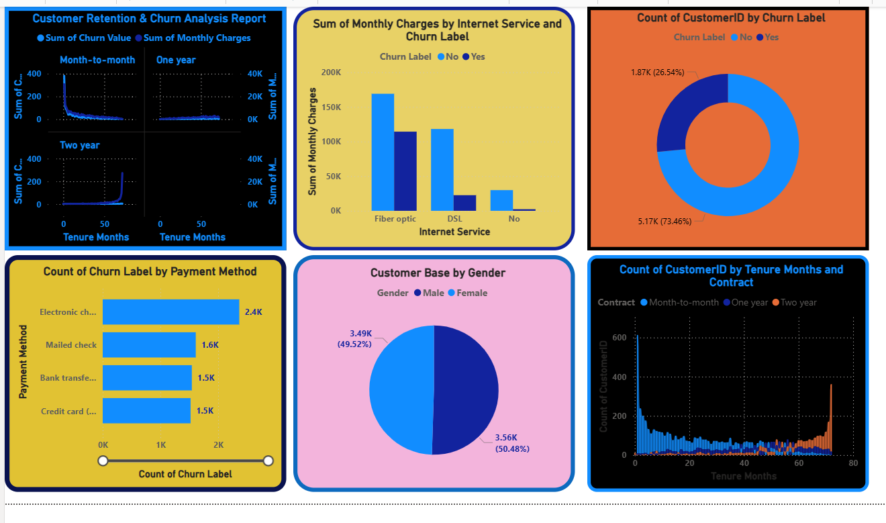

To me  
Liton Islam

litonislamnext@gmail.com.

# Customer-Churn-Analysis
This analysis explores key factors driving customer churn—including credit score, tenure, bank balance, and salary. By identifying high-risk patterns in customer behavior, this dashboard provides actionable insights to optimize retention strategies and improve overall customer lifetime value.

### 📉 Customer Churn Analysis

---

---

  

📝 Project Overview

This project provides a data-driven analysis of customer churn within an e-commerce context. The dashboard monitors key demographic and geographic factors to understand why customers leave and helps in formulating effective retention strategies.

​🔑 Key Features

    ​Customer Status: Visualizes the breakdown of customers into Active, Churned, and Joined categories.
    ​Churn by Gender: Comparative analysis of churn behavior between Male and Female customers.
    ​Churn by Age: Insights into churn trends across different age groups, identifying which age segments are most prone to attrition.
    ​Churn by Geography: A geographic breakdown showing churn rates by country, enabling location-specific retention efforts.

​🛠 Tech Stack

    ​Language: Python
    ​Libraries: Pandas, Matplotlib, Seaborn
    ​Analysis: Statistical correlation between demographics and churn risk.

​🔍 Key Insights

    ​Demographic Sensitivity: Churn patterns vary significantly across age and gender, suggesting that marketing communications should be personalized based on these segments.
    ​Geographical Impact: Specific countries show higher churn volatility, indicating potential market-specific issues or competitive pressure.
    ​Strategic Planning: Understanding the volume of 'Churned' vs 'Active' users provides a clear benchmark for setting future retention targets.

🚀 Explore the Full Analysis on Kaggle:
* 📊[Notebook]https://www.kaggle.com/code/litonislam/customer-churn-analysis-data-visualization
* 📊[Dataset]https://www.kaggle.com/datasets/litonislam/customer-churn-analysis

